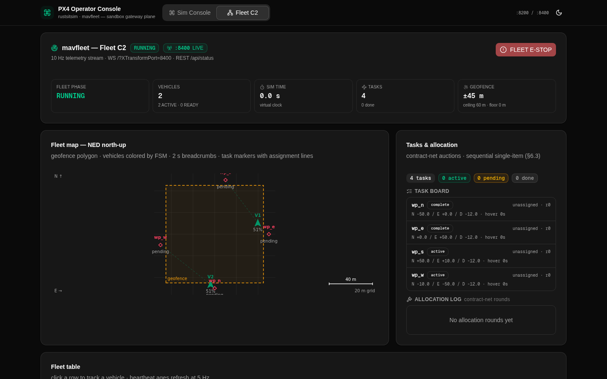

<div align="center">

# RustSim

**PX4-native lockstep simulation, multi-vehicle fleet operations, and a live operator console — pure Rust, real PX4.**

[](sim)
[](fleet)
[](docs/VERIFICATION.md)
[](docs/VERIFICATION.md)
[](docs/images/rustsim-fleetc2-live.png)
[](LICENSE)

</div>

---

RustSim is a unified simulation and fleet-operations testbed for **unmodified
[PX4-Autopilot](https://px4.io) v1.16.2 SITL**, built from three live-verified
components:

| Component | What it is |
|---|---|
| **[sim/](sim)** — *RustSim Core* | A lockstep HIL flight simulator that replaces Gazebo/jMAVSim entirely: hand-rolled MAVLink v2 codec (golden-vectored against PX4's own headers), 6-DOF quadrotor dynamics, BMI088-class sensor models, a 10-fault injection engine, deterministic replays, REST+WS control plane. |
| **[fleet/](fleet)** — *RustSim Fleet* | A multi-vehicle mission manager: spawns sim+PX4 pairs, allocates tasks by sequential auction (Hungarian baseline), flies offboard missions at a 20 Hz setpoint cadence, enforces an 8-policy safety ladder, writes run reports with CI-classifiable exit codes. |
| **[console/](console)** — *RustSim Console* | A Next.js operator console with two live views — the Sim Console (10 Hz physics telemetry, strip charts, live fault injection) and Fleet C2 (fleet table, NED map, task board, event log, e-stop) — with honest LIVE/SIMULATED dual-mode. |

**No Gazebo. No jmavsim. No external MAVLink crate. No database.** The whole
stack is Rust + TypeScript, speaks PX4's native HIL TCP wire, and every
protocol claim in the docs is backed by a live capture against real PX4.



*The Fleet C2 console during a live F-2 run: two vehicles, each driven by its
own RustSim Core instance + a real PX4 SITL process, flying an auctioned
4-waypoint mission in OFFBOARD mode.*

## Live-verified, not "should work"

Every headline claim has a single-invocation harness and a recorded PASS
([docs/VERIFICATION.md](docs/VERIFICATION.md)):

- **I-1 — boot gate**: PX4 rcS completes on our HIL stream, EKF2 estimator
  output flows, heartbeats + loop-closure + ULog verified.
- **I-2 — physical flight**: arm → OFFBOARD climb → hover → land → disarm,
  proven from the simulator's replay ground truth (not the EKF's opinion).
- **F-1 — fleet bring-up**: N vehicles READY with live health; operator
  e-stop → ABORTED(2) with report + event log; clean port teardown.
- **F-2 — the real thing**: 2 vehicles × full RustSim Core instances fly an
  auctioned mission with real dynamics — hover observed at the waypoints,
  RTL, land, disarm — asserted from replay ground truth.
- **Browser-live**: the operator console drives the same fleet through the
  preview gateway; LIVE badges, moving telemetry, screenshots captured.

## Architecture

```
browser ── gateway :81 (XTransformPort) ──┬─ :8200+i  RustSim Core (per vehicle)
                                          └─ :8400   RustSim Fleet manager
                                                     │ spawns + MAVLink UDP links
                     PX4 SITL v1.16.2 ◄── TCP 4560+i ─┘ (HIL lockstep, 200 Hz)
```

Full port map and data flows: [docs/ARCHITECTURE.md](docs/ARCHITECTURE.md).

## Quickstart

Prerequisites: Rust stable, Node 20+, Python 3.12+ (`pymavlink`, `pyulog`),
and PX4-Autopilot v1.16.2 built once:

```bash
git clone --depth 1 --branch v1.16.2 --recurse-submodules --shallow-submodules \
    https://github.com/PX4/PX4-Autopilot.git ../PX4-Autopilot
(cd ../PX4-Autopilot && make px4_sitl_default)

(cd sim   && cargo build --workspace)
(cd fleet && cargo build --workspace)
(cd console && npm install && npm run build)
```

> Setting this up in the Z.AI sandbox (or a lean container without Rust /
> cmake / a full npm registry)? Follow
> [docs/SANDBOX_SETUP.md](docs/SANDBOX_SETUP.md) — the exact verified
> sequence, including every environment-specific fix.

Fly one vehicle, for real:

```bash
(cd sim && bash tests/run_i2_flight.sh)      # ~3 min, expects "I-2 PASS"
```

Fly the fleet and watch it in the console:

```bash
(cd fleet && bash tests/run_f2.sh)           # ~3 min, expects "F-2 PASS"
bash scripts/browser_live_test.sh            # full stack through the gateway
```

Manual tour: `docs/OPERATIONS.md` — raw control planes, fault injection via
REST, the demo scenario, environment knobs.

## Protocol highlights (the hard-won ones)

PX4's pinned v1.16.2 dialect diverges from the official MAVLink common.xml in
ways that only live capture reveals — all documented with evidence in
[sim/docs/PROTOCOL.md](sim/docs/PROTOCOL.md) and the ADRs:

- `HIL_ACTUATOR_CONTROLS` is packed with **size-sorted core fields**
  (`flags@8, controls@16, mode@80`), not the official extension layout
  ([ADR-0015](sim/docs/adr/0015-px4-v116-actuator-layout.md)).
- PX4 v1.16 sends **per-motor normalized thrust [0,1]**, not the jMAVSim-era
  [-1,1] ([ADR-0011](sim/docs/adr/0011-hil-actuator-pwm-mapping.md)).
- A **noiseless IMU or mag starves EKF2** and blocks arming — sensor noise is
  a correctness feature ([ADR-0012](sim/docs/adr/0012-noiseless-mag-starves-ekf2.md),
  [ADR-0014](sim/docs/adr/0014-realistic-sensor-noise-determinism.md)).
- `DO_SET_MODE` takes decomposed param2/param3, not the packed mode word
  ([ADR-0010](fleet/docs/adr/0010-do-set-mode-param-layout.md)).
- Grounded, co-located vehicles must not trigger vertical-separation
  overrides — they can't comply, and the hijacked goal stream pins the fleet
  on the ground ([ADR-0011](fleet/docs/adr/0011-grounded-separation-gate.md)).

## Repository layout

```
sim/       RustSim Core   — 8 crates, docs/ (SPEC, PROTOCOL, ADRs), live harnesses
fleet/     RustSim Fleet  — 8 crates, docs/ (SPEC, SCENARIOS, ADRs), live harnesses
console/   RustSim Console— Next.js 16 app, dual API routing (gateway/direct)
docs/      architecture, verification record, operations runbook, evidence images
scripts/   cross-repo live test (browser), golden-vector generator
```

Each component carries its own `AGENTS.md` (the [DOX](https://github.com/agent0ai/dox)
contract hierarchy): the root [AGENTS.md](AGENTS.md) is the rail, and
`sim/`, `fleet/`, `console/`, `docs/`, `scripts/` own their local contracts.

## Development

```bash
(cd sim   && cargo test --workspace)   # 99+ tests
(cd fleet && cargo test --workspace)   # 126+ tests
(cd console && npm run lint && npm run build)
```

Integration harnesses are single-invocation by design (start → assert →
teardown in one shell call); do not split them, and do not shrink the
measured time budgets without re-running the corresponding live case.

## Roadmap

- Offboard mission commands beyond position goals (velocity/attitude
  setpoints, camera/gimbal payload channels).
- Fault events in fleet scenarios wired to the sims' REST fault plane
  (today the F-catalog lives on the sim side).
- Console: mission editing (waypoint placement on the NED map).
- CI matrix across PX4 versions to track dialect drift.

## License

Apache-2.0 — see [LICENSE](LICENSE). PX4-Autopilot is BSD-licensed and is a
build-time external dependency, not vendored here.
