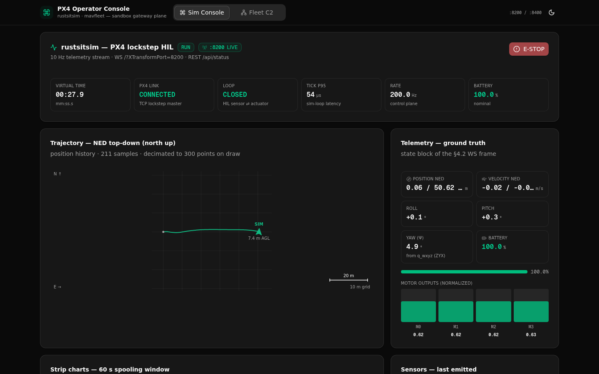

# RustSim Console

Live operator console for the [RustSim](../README.md) stack — one page, two
telemetry engines:

| Console | Backend | What you get |
|---|---|---|
| **Sim Console** | rustsitsim `:8200` | 10 Hz physics telemetry (altitude/attitude/motor strip charts, NED track), tick latency p95, battery, live **fault injection** (10 fault types) and e-stop |
| **Fleet C2** | mavfleet `:8400` | fleet table (mode/FSM/health/heartbeat ages), NED map with geofence + task markers, task board, auction/allocation log, event log, operator e-stop |

Both consoles run **dual-mode**: LIVE when the Rust backend answers,
SIMULATED (client-side mock) when it does not — with automatic 12 s live
retry and a badge that never lies about which mode you are in.




## Run it

```bash
npm install
npm run build && npm start        # production (standalone, ~150 MB RSS)
# or: npm run dev
```

The console itself is a static client — start the Rust backends to see live
data:

```bash
# from the repo root
cd fleet && cargo build --workspace
./target/debug/mavfleet run --fleet tests/demo_live.toml --api-port 8400
```

### Routing modes

| Mode | When | How |
|---|---|---|
| **gateway** (default) | behind the Caddy gateway / a preview proxy | every request is a relative path + `?XTransformPort=<port>`; WS at `/?XTransformPort=<port>` — see `Caddyfile.example` |
| **direct** | local runs without a gateway | `NEXT_PUBLIC_RSIM_API_STYLE=direct npm run build` → absolute `http://127.0.0.1:<port>` REST + `ws://127.0.0.1:<port>/` |

For the gateway mode locally: [install Caddy](https://caddyserver.com/docs/install),
copy `Caddyfile.example` to a `Caddyfile`, `caddy run`, open
`http://localhost:81`.

## Layout

```
src/
  app/                 layout, page (the dual-console shell), globals.css
  components/dashboard SimConsole, FleetC2, charts, maps, fault console
  components/ui/       the shadcn-style primitives actually used
  hooks/               useSimConsole / useFleetC2 (the live+mock engines)
  lib/                 conn (routing + protocol normalizers), types, mocks
```

See [AGENTS.md](AGENTS.md) for the component's working contracts.
