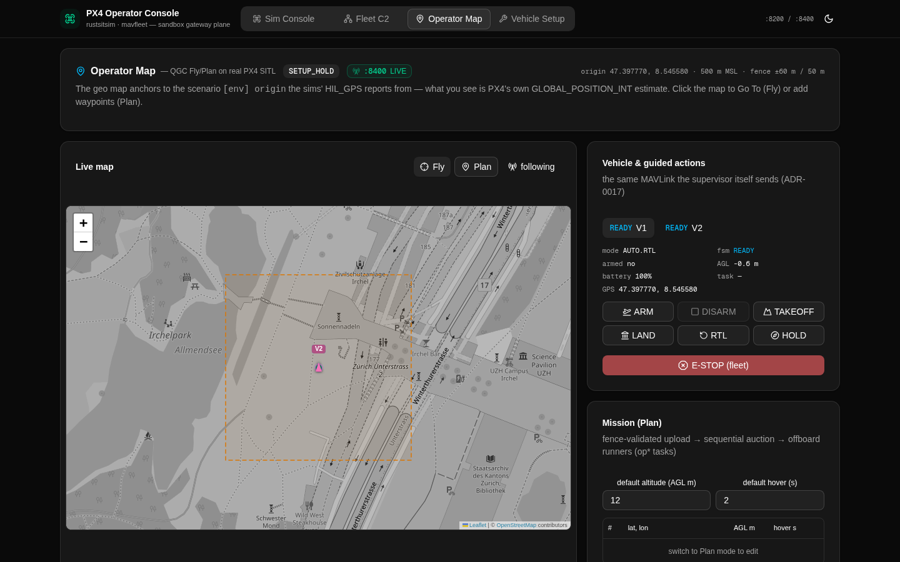

# RustSim Console

Live operator console for the [RustSim](../README.md) stack — one page,
the **Operations Canvas**: a full-bleed MapLibre map with edge
furniture (status strip, left rail, telemetry column, command bar) and
7 overlay panels (single-overlay-mode; opened from the left rail):

| Overlay | Backend | What you get |
|---|---|---|
| **Mission Strip** | catalog `:8300` | mission editor + geofence drawing + validation + save/upload (ADR-0019/0026) |
| **Library** | catalog `:8300` | mission catalog browser + recall (ADR-0020) |
| **Fleet C2** | mavfleet `:8400` | fleet table (Cards / Bindings / Events; swarming-patterns dropdown removed 2026-09-10), e-stop |
| **SITL Manager** | supervisor `:8500` | the operator-facing entry to start/stop SITL (QGC/MP pattern, ADR-0030; new 2026-09-10). Replaces the removed Sim Console / Sim Control panel. |
| **Setup Drawer** | mavfleet `:8400` | the QGC/MP-style configuration workflow (ADR-0016): airframe catalog (UAV/USV/UUV), sensor calibration triggers, power/safety params, flight modes, the live param editor |
| **Analyze** | catalog `:8300` | ULog browser + topic plotting (the `.replay` scrub tab was removed 2026-09-10) |
| **Pre-Flight** | mavfleet `:8400` | pre-arm checklist + prearm-check REST surface |
| **Settings** | — | map view options (basemap, North/Track-up, 2D/3D pitch, 7 layer toggles — new 2026-09-10) + PX4 version policy (ADR-0029) + about |
| **Cheat Sheet** | — | keyboard shortcuts reference dialog (`?` or left-rail button) |

All overlays run **dual-mode**: LIVE when the Rust backend answers,
SIMULATED (client-side mock) when it does not — with automatic 12 s
live retry and a badge that never lies about which mode you are in.



> The Operations Canvas's geo view anchors to the scenario `[env]
> origin` the sims' HIL_GPS reports from (default: the PX4 test field
> 47.397770, 8.545580) — the map renders PX4's own
> `GLOBAL_POSITION_INT` estimate, not simulator truth. The map
> provider is selected in the Settings overlay (6 basemap providers);
> an honest graticule fallback is used when tiles are unreachable.

## Run it

```bash
npm install
npm run build && npm start        # production (standalone, ~150 MB RSS)
# or: npm run dev
```

The console itself is a static client. The persistent operator stack
(catalog + supervisor + console; ADR-0030) is started from the repo
root:

```bash
# from the repo root
scripts/stack_up.sh start    # brings up catalog :8300 + supervisor :8500 + console :3000 (NO fleet)
# SITL is then started on-demand — either via the GCS UI's SITL
# Manager overlay panel (POST :8500/api/sitl/start) or via
# `scripts/stack_up.sh start-fleet` for CLI users.
scripts/stack_up.sh status    # four-plane state
scripts/stack_up.sh stop      # POST :8500/api/sitl/stop, then teardown
```

### Routing modes

| Mode | When | How |
|---|---|---|
| **gateway** (default) | behind the Caddy gateway / a preview proxy | every request is a relative path + `?XTransformPort=<port>`; WS at `/?XTransformPort=<port>` — see `Caddyfile.example`. `<port>` selects: `8300` (catalog), `8400` (fleet), `8500` (supervisor). |
| **direct** | local runs without a gateway | `NEXT_PUBLIC_RSIM_API_STYLE=direct npm run build` → absolute `http://127.0.0.1:<port>` REST + `ws://127.0.0.1:<port>/` |

For the gateway mode locally: [install Caddy](https://caddyserver.com/docs/install),
copy `Caddyfile.example` to a `Caddyfile`, `caddy run`, open
`http://localhost:81`.

## Layout

```
src/
  app/                 layout, page (the Operations Canvas shell), globals.css
  components/canvas/   OperationsCanvas (zone A–H grid), MapCanvas
                       (full-bleed MapLibre), strip/ + rail/ + column/ +
                       bar/ + notify/ (edge furniture), overlays/
                       (MissionStrip, LibraryPanel, FleetC2Panel,
                       SitlManagerPanel, SetupDrawer, AnalyzeOverlay,
                       PreFlightPanel, SettingsPanel, OnboardingTour,
                       GotoConfirmChip), map/ (camera, layers,
                       context-menu), FlushLoop, ShortcutsProvider
  components/ui/       the shadcn-style primitives actually used
  hooks/               useFleetC2 / usePlanCatalog / useSitlSupervisor /
                       useVehicleSetup / useAnalyze (the live+mock engines)
  state/               app-store (overlay toggles), map-settings
                       (basemap + orientation + projection + layer-visibility,
                       new 2026-09-10), plan-store, ring-buffer,
                       telemetry-store, command-bus
  lib/                 conn (routing + protocol normalizers), geo (WGS84
                       NED<->geodetic port), types, plan-types, mocks
```

The geo math in `src/lib/geo.ts` is a TS port of the Rust `GeoOrigin`
(exact via ECEF + Bowring) — the console converts fence/task NED to
lat/lon with the same numbers the fleet manager uses server-side.

## Browser verification

- `../scripts/browser_live_test.sh` — overlays LIVE, telemetry moving
- `../scripts/browser_setup_test.sh` — the Setup Drawer end-to-end
- `../scripts/browser_map_test.sh` — the Operations Canvas end-to-end
  (map clicks place waypoints, upload, start mission, live flight)

See [AGENTS.md](AGENTS.md) for the component's working contracts.
